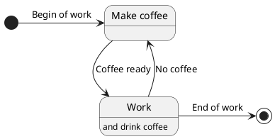
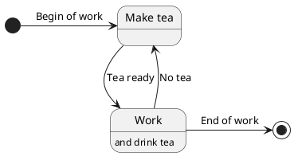

# Mugs
## Coffee

```plantuml
@startuml

state "Work" as work : and drink coffee
state "Make coffee" as makeCoffee

[*] -r-> makeCoffee : Begin of work
makeCoffee -d-> work : Coffee ready
work -u-> makeCoffee : No coffee
work -r-> [*] : End of work

@enduml
```

## Tea

```plantuml
@startuml

state "Work" as work : and drink tea
state "Make tea" as makeTea

[*] -r-> makeTea : Begin of work
makeTea -d-> work : Tea ready
work -u-> makeTea : No tea
work -r-> [*] : End of work

@enduml
```
